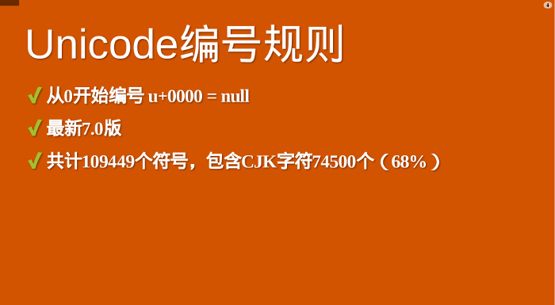
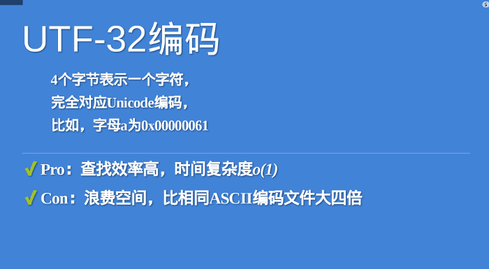
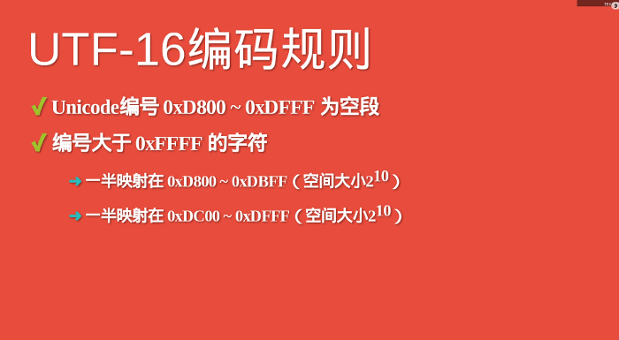
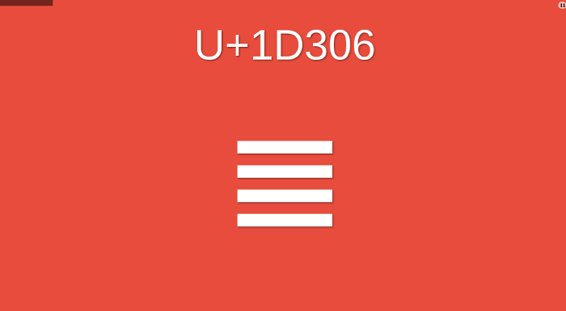
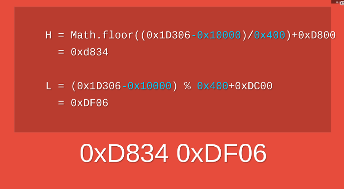
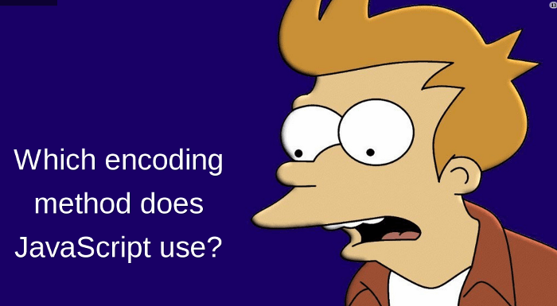

# 字符编码

## Unicode

### What Unicode ?

> Unicode源于一个很简单的想法：将全世界所有的字符包含在一个集合里，计算机只要支持这一个字符集，就能显示所有的字符，再也不会有乱码了。

Unicode源于一个很简单的想法：将全世界所有的字符包含在一个集合里，计算机只要支持这一个字符集，就能显示所有的字符，再也不会有乱码了。

```unicode
U+0000 = null
```

U+表示紧跟在后面的十六进制数是Unicode的码点

### [Unicode](http://www.unicode.org/) 编号规则



1. 从 0 开始编号 U+0000 = null
2. 最新[Unicode@11.0.0](http://www.unicode.org/versions/Unicode11.0.0/)
3. 共计137,374个符号，包含CJK字符74500个（68%）
4. 2^16(65535)个号码组成一个平面
5. 目前有17个平面，整个空间大小：2^21
6. 1个基本平面(BMP)：U+0000 ~ U+FFFF
7. 16个辅助平面(SMP): U+010000 ~ U+10FFFF

中日韩文字为74500个。可以近似认为，全世界现有的符号当中，三分之二以上来自东亚文字。比如，中文"好"的码点是十六进制的`597D`

`U+597D` = 好

### 分区

> 这么多符号，Unicode不是一次性定义的，而是分区定义。每个区可以存放65536个（216）字符，称为一个平面（plane）。目前，一共有17个（25）平面，也就是说，整个Unicode字符集的大小现在是221。


最前面的65536个字符位，称为基本平面（缩写**BMP**），它的码点范围是从0一直到`(2^16)-1`，写成16进制就是从`U+0000`到`U+FFFF`。所有最常见的字符都放在这个平面，这是Unicode最先定义和公布的一个平面。

剩下的字符都放在辅助平面（缩写**SMP**），码点范围从`U+010000`一直到`U+10FFFF`。

## UTF-32 VS UTF-8

Unicode只规定了**每个字符的码点**，到底用什么样的**字节序**表示这个码点，就涉及到**编码方法**。

最直观的编码方法是，**每个码点**使用**四个字节**表示，**字节内容一一对应码点**。这种编码方法就叫做**UTF-32**。比如，**码点0**就用**四个字节的0**表示，**码点597D**就在前面加两个字节的0。

```unicode<->utf-32
U+0000 = 0x0000 0000
U+597D = 0x0000 597D
```

### UTF-32 编码



1. 4个字节表示一个字符
2. 完全对应 Unicode 编码（比如：字母`a`=`0x00000061`）
3. Pro: 查找效率高，时间复杂度o(1)
4. Con: 浪费空间。比相同 ASCII 编码文件大4倍

UTF-32的优点在于，转换规则简单直观，查找效率高。缺点在于浪费空间，同样内容的英语文本，它会比ASCII编码大四倍。这个缺点很致命，导致实际上没有人使用这种编码方法，HTML 5标准就明文规定，网页不得编码成UTF-32。

### 如何节省空间的表示法？

人们真正需要的是一种节省空间的编码方法，这导致了UTF-8的诞生。**UTF-8是一种变长的编码方法**，字符长度从**1个字节到4个字节不等**。越是**常用的字符，字节越短**，最前面的**128个字符，只使用1个字节表示**，与**ASCII码完全相同**。

<table>
<tr>
<td>编号范围</td>
<td>字节</td>
</tr>
<tr>
<td>0x0080 - 0x07FF</td>
<td>2</td>
</tr>
<tr>
<td>0x0800 - 0xFFFF</td>
<td>3</td>
</tr>
<tr>
<td>0x010000 - 0x10FFFF</td>
<td>4</td>
</tr>
</table>

由于UTF-8这种节省空间的特性，导致它成为互联网上最常见的网页编码。不过，参考[《字符编码笔记》](http://www.ruanyifeng.com/blog/2007/10/ascii_unicode_and_utf-8.html)

## UTF-16 简介

UTF-16编码介于UTF-32与UTF-8之间，同时结合了定长和变长两种编码方法的特点。

它的编码规则很简单：基本平面的字符占用2个字节，辅助平面的字符占用4个字节。也就是说，UTF-16的编码长度要么是2个字节（U+0000到U+FFFF），要么是4个字节（U+010000到U+10FFFF）。


**于是就有一个问题，当我们遇到两个字节，怎么看出它本身是一个字符，还是需要跟其他两个字节放在一起解读？**

说来很巧妙，我也不知道是不是故意的设计，在基本平面内，从U+D800到U+DFFF是一个空段，即这些码点不对应任何字符。因此，这个空段可以用来映射辅助平面的字符。

具体来说，辅助平面的字符位共有220个，也就是说，对应这些字符至少需要20个二进制位。UTF-16将这20位拆成两半，前10位映射在U+D800到U+DBFF（空间大小210），称为高位（H），后10位映射在U+DC00到U+DFFF（空间大小210），称为低位（L）。这意味着，一个辅助平面的字符，被拆成两个基本平面的字符表示。



所以，当我们遇到两个字节，发现它的码点在U+D800到U+DBFF之间，就可以断定，紧跟在后面的两个字节的码点，应该在U+DC00到U+DFFF之间，这四个字节必须放在一起解读。

### UTF-16的转码公式

Unicode码点转成UTF-16的时候，首先区分这是基本平面字符，还是辅助平面字符。如果是前者，直接将码点转为对应的十六进制形式，长度为两字节。

``` unicode->utf-16
U+597D = 0x597D
```

如果是辅助平面字符，Unicode 3.0版给出了转码公式

``` unicode->utf-16
H = Math.floor((c-0x10000) / 0x400)+0xD800
L = (c - 0x10000) % 0x400 + 0xDC00
```



以字符(三+-)为例，它是一个辅助平面字符，码点为U+1D306，将其转为UTF-16的计算过程如下。

``` unicode->utf-16
H = Math.floor((0x1D306-0x10000)/0x400)+0xD800 = 0xD834
L = (0x1D306-0x10000) % 0x400+0xDC00 = 0xDF06
```

所以，字符(三+-)的UTF-16编码就是0xD834 DF06，长度为四个字节。



## JavaScript使用哪一种编码？



JavaScript语言采用Unicode字符集，但是只支持一种编码方法。

这种编码既不是UTF-16，也不是UTF-8，更不是UTF-32。上面那些编码方法，JavaScript都不用。

JavaScript用的是UCS-2！


### UCS-2编码

怎么突然杀出一个UCS-2？这就需要讲一点历史。

互联网还没出现的年代，曾经有两个团队，不约而同想搞统一字符集。一个是1988年成立的Unicode团队，另一个是1989年成立的UCS团队。等到他们发现了对方的存在，很快就达成一致：世界上不需要两套统一字符集。

1991年10月，两个团队决定合并字符集。也就是说，从今以后只发布一套字符集，就是Unicode，并且修订此前发布的字符集，UCS的码点将与Unicode完全一致。

UCS的开发进度快于Unicode，1990年就公布了第一套编码方法UCS-2，使用2个字节表示已经有码点的字符。（那个时候只有一个平面，就是基本平面，所以2个字节就够用了。）UTF-16编码迟至1996年7月才公布，明确宣布是UCS-2的超集，即基本平面字符沿用UCS-2编码，辅助平面字符定义了4个字节的表示方法。

两者的关系简单说，就是UTF-16取代了UCS-2，或者说UCS-2整合进了UTF-16。所以，现在只有UTF-16，没有UCS-2。

### JavaScript的诞生背景

那么，为什么JavaScript不选择更高级的UTF-16，而用了已经被淘汰的UCS-2呢？

答案很简单：非不想也，是不能也。因为在JavaScript语言出现的时候，还没有UTF-16编码。

1995年5月，Brendan Eich用了10天设计了JavaScript语言；10月，第一个解释引擎问世；次年11月，Netscape正式向ECMA提交语言标准（整个过程详见[《JavaScript诞生记》](http://www.ruanyifeng.com/blog/2011/06/birth_of_javascript.html)）。对比UTF-16的发布时间（1996年7月），就会明白Netscape公司那时没有其他选择，只有UCS-2一种编码方法可用！


### JavaScript字符函数的局限

由于JavaScript只能处理UCS-2编码，造成所有字符在这门语言中都是2个字节，如果是4个字节的字符，会当作两个双字节的字符处理。JavaScript的字符函数都受到这一点的影响，无法返回正确结果。


还是以字符(三+-)为例，它的UTF-16编码是4个字节的0xD834 DF06。问题就来了，4个字节的编码不属于UCS-2，JavaScript不认识，只会把它看作单独的两个字符U+D834和U+DF06。前面说过，这两个码点是空的，所以JavaScript会认为是两个空字符组成的字符串！


上面代码表示，JavaScript认为字符的长度是2，取到的第一个字符是空字符，取到的第一个字符的码点是0xDB34。这些结果都不正确！


解决这个问题，必须对码点做一个判断，然后手动调整。下面是正确的遍历字符串的写法。

``` js
while (++index < length) {
  // ...
  if (charCode >= 0xD800 && charCode <= 0xDBFF) {
    output.push(character + string.charAt(++index));
  } else {
    output.push(character);
  }
}
```

上面代码表示，遍历字符串的时候，必须对码点做一个判断，只要落在0xD800到0xDBFF的区间，就要连同后面2个字节一起读取。

类似的问题存在于所有的JavaScript字符操作函数。

``` js
String.prototype.replace()
String.prototype.substring()
String.prototype.slice()
...
```

上面的函数都只对2字节的码点有效。要正确处理4字节的码点，就必须逐一部署自己的版本，判断一下当前字符的码点范围。

## ECMAScript 6


JavaScript的下一个版本ECMAScript 6（简称ES6），大幅增强了Unicode支持，基本上解决了这个问题。

正确识别字符

ES6可以自动识别4字节的码点。因此，遍历字符串就简单多了。

``` es6
for (let s of string ) {
  // ...
}
```

但是，为了保持兼容，length属性还是原来的行为方式。为了得到字符串的正确长度，可以用下面的方式。

``` es6
Array.from(string).length
```

码点表示法

JavaScript允许直接用码点表示Unicode字符，写法是"反斜杠+u+码点"。

``` es6
'好' === '\u597D' // true
```

但是，这种表示法对4字节的码点无效。ES6修正了这个问题，只要将码点放在大括号内，就能正确识别。


字符串处理函数

ES6新增了几个专门处理4字节码点的函数。

``` es6
String.fromCodePoint()：从Unicode码点返回对应字符
String.prototype.codePointAt()：从字符返回对应的码点
String.prototype.at()：返回字符串给定位置的字符
```

正则表达式

ES6提供了u修饰符，对正则表达式添加4字节码点的支持。


Unicode正规化

有些字符除了字母以外，还有[附加符号](http://zh.wikipedia.org/wiki/%E9%99%84%E5%8A%A0%E7%AC%A6%E5%8F%B7)。比如，汉语拼音的Ǒ，字母上面的声调就是附加符号。对于许多欧洲语言来说，声调符号是非常重要的。


Unicode提供了两种表示方法。一种是带附加符号的单个字符，即一个码点表示一个字符，比如Ǒ的码点是U+01D1；另一种是将附加符号单独作为一个码点，与主体字符复合显示，即两个码点表示一个字符，比如Ǒ可以写成O（U+004F） + ˇ（U+030C）。

``` es6
// 方法一
'\u01D1'
// 'Ǒ'

// 方法二
'\u004F\u030C'
// 'Ǒ'

```

这两种表示方法，视觉和语义都完全一样，理应作为等同情况处理。但是，JavaScript无法辨别。


``` ES6
'\u01D1'==='\u004F\u030C'
 //false
```

ES6提供了normalize方法，允许"Unicode正规化"，即将两种方法转为同样的序列。

``` ES6
 '\u01D1'.normalize() === '\u004F\u030C'.normalize() 
 // true
 ```

## ASCII 码

我们知道，计算机内部，所有信息最终都是一个二进制值。每一个二进制位（bit）有0和1两种状态，因此八个二进制位就可以组合出256种状态，这被称为一个字节（byte）。也就是说，一个字节一共可以用来表示256种不同的状态，每一个状态对应一个符号，就是256个符号，从00000000到11111111。

上个世纪60年代，美国制定了一套字符编码，对英语字符与二进制位之间的关系，做了统一规定。这被称为 ASCII 码，一直沿用至今。

ASCII 码一共规定了128个字符的编码，比如空格SPACE是32（二进制00100000），大写的字母A是65（二进制01000001）。这128个符号（包括32个不

## 非 ASCII 编码

英语用128个符号编码就够了，但是用来表示其他语言，128个符号是不够的。比如，在法语中，字母上方有注音符号，它就无法用 ASCII 码表示。于是，一些欧洲国家就决定，利用字节中闲置的最高位编入新的符号。比如，法语中的é的编码为130（二进制10000010）。这样一来，这些欧洲国家使用的编码体系，可以表示最多256个符号。

但是，这里又出现了新的问题。不同的国家有不同的字母，因此，哪怕它们都使用256个符号的编码方式，代表的字母却不一样。比如，130在法语编码中代表了é，在希伯来语编码中却代表了字母Gimel (ג)，在俄语编码中又会代表另一个符号。但是不管怎样，所有这些编码方式中，0--127表示的符号是一样的，不一样的只是128--255的这一段。

至于亚洲国家的文字，使用的符号就更多了，汉字就多达10万左右。一个字节只能表示256种符号，肯定是不够的，就必须使用多个字节表达一个符号。比如，简体中文常见的编码方式是 GB2312，使用两个字节表示一个汉字，所以理论上最多可以表示 256 x 256 = 65536 个符号。

中文编码的问题需要专文讨论，这篇笔记不涉及。这里只指出，虽然都是用多个字节表示一个符号，但是GB类的汉字编码与后文的 Unicode 和 UTF-8 是毫无关系的。

## Unicode 的问题

需要注意的是，Unicode 只是一个符号集，它只规定了符号的二进制代码，却没有规定这个二进制代码应该如何存储。

比如，汉字严的 Unicode 是十六进制数4E25，转换成二进制数足足有15位（100111000100101），也就是说，这个符号的表示至少需要2个字节。表示其他更大的符号，可能需要3个字节或者4个字节，甚至更多。

这里就有两个严重的问题，第一个问题是，如何才能区别 Unicode 和 ASCII ？计算机怎么知道三个字节表示一个符号，而不是分别表示三个符号呢？第二个问题是，我们已经知道，英文字母只用一个字节表示就够了，如果 Unicode 统一规定，每个符号用三个或四个字节表示，那么每个英文字母前都必然有二到三个字节是0，这对于存储来说是极大的浪费，文本文件的大小会因此大出二三倍，这是无法接受的。

它们造成的结果是：1）出现了 Unicode 的多种存储方式，也就是说有许多种不同的二进制格式，可以用来表示 Unicode。2）Unicode 在很长一段时间内无法推广，直到互联网的出现。

## UTF-8

互联网的普及，强烈要求出现一种统一的编码方式。UTF-8 就是在互联网上使用最广的一种 Unicode 的实现方式。其他实现方式还包括 UTF-16（字符用两个字节或四个字节表示）和 UTF-32（字符用四个字节表示），不过在互联网上基本不用。**重复一遍，这里的关系是，UTF-8 是 Unicode 的实现方式之一**。

UTF-8 最大的一个特点，就是它是一种变长的编码方式。它可以使用1~4个字节表示一个符号，根据不同的符号而变化字节长度。

UTF-8 的编码规则很简单，只有二条：

1）对于单字节的符号，字节的第一位设为0，后面7位为这个符号的 Unicode 码。因此对于英语字母，UTF-8 编码和 ASCII 码是相同的。

2）对于n字节的符号（n > 1），第一个字节的前n位都设为1，第n + 1位设为0，后面字节的前两位一律设为10。剩下的没有提及的二进制位，全部为这个符号的 Unicode 码。

下表总结了编码规则，字母x表示可用编码的位。

``` CODE
Unicode符号范围     |        UTF-8编码方式
(十六进制)        |              （二进制）
----------------------+---------------------------------------------
0000 0000-0000 007F | 0xxxxxxx
0000 0080-0000 07FF | 110xxxxx 10xxxxxx
0000 0800-0000 FFFF | 1110xxxx 10xxxxxx 10xxxxxx
0001 0000-0010 FFFF | 11110xxx 10xxxxxx 10xxxxxx 10xxxxxx
```

跟据上表，解读 UTF-8 编码非常简单。如果一个字节的第一位是0，则这个字节单独就是一个字符；如果第一位是1，则连续有多少个1，就表示当前字符占用多少个字节。

下面，还是以汉字严为例，演示如何实现 UTF-8 编码。

严的 Unicode 是4E25（100111000100101），根据上表，可以发现4E25处在第三行的范围内（0000 0800 - 0000 FFFF），因此严的 UTF-8 编码需要三个字节，即格式是1110xxxx 10xxxxxx 10xxxxxx。然后，从严的最后一个二进制位开始，依次从后向前填入格式中的x，多出的位补0。这样就得到了，严的 UTF-8 编码是11100100 10111000 10100101，转换成十六进制就是E4B8A5。

## Unicode 与 UTF-8 之间的转换

通过上一节的例子，可以看到严的 Unicode码 是4E25，UTF-8 编码是E4B8A5，两者是不一样的。它们之间的转换可以通过程序实现。

Windows平台，有一个最简单的转化方法，就是使用内置的记事本小程序notepad.exe。打开文件后，点击文件菜单中的另存为命令，会跳出一个对话框，在最底部有一个编码的下拉条。

里面有四个选项：ANSI，Unicode，Unicode big endian和UTF-8。

1）ANSI是默认的编码方式。对于英文文件是ASCII编码，对于简体中文文件是GB2312编码（只针对 Windows 简体中文版，如果是繁体中文版会采用 Big5 码）。

2）Unicode编码这里指的是notepad.exe使用的 UCS-2 编码方式，即直接用两个字节存入字符的 Unicode 码，这个选项用的 little endian 格式。

3）Unicode big endian编码与上一个选项相对应。我在下一节会解释 little endian 和 big endian 的涵义。

4）UTF-8编码，也就是上一节谈到的编码方法。

选择完"编码方式"后，点击"保存"按钮，文件的编码方式就立刻转换好了。

## Little endian 和 Big endian

上一节已经提到，UCS-2 格式可以存储 Unicode 码（码点不超过0xFFFF）。以汉字严为例，Unicode 码是4E25，需要用两个字节存储，一个字节是4E，另一个字节是25。存储的时候，4E在前，25在后，这就是 Big endian 方式；25在前，4E在后，这是 Little endian 方式。

这两个古怪的名称来自英国作家斯威夫特的《格列佛游记》。在该书中，小人国里爆发了内战，战争起因是人们争论，吃鸡蛋时究竟是从大头(Big-endian)敲开还是从小头(Little-endian)敲开。为了这件事情，前后爆发了六次战争，一个皇帝送了命，另一个皇帝丢了王位。

第一个字节在前，就是"大头方式"（Big endian），第二个字节在前就是"小头方式"（Little endian）。

那么很自然的，就会出现一个问题：计算机怎么知道某一个文件到底采用哪一种方式编码？

Unicode 规范定义，每一个文件的最前面分别加入一个表示编码顺序的字符，这个字符的名字叫做"零宽度非换行空格"（zero width no-break space），用FEFF表示。这正好是两个字节，而且FF比FE大1。

如果一个文本文件的头两个字节是FE FF，就表示该文件采用大头方式；如果头两个字节是FF FE，就表示该文件采用小头方式。

## 实例

打开"记事本"程序notepad.exe，新建一个文本文件，内容就是一个严字，依次采用ANSI，Unicode，Unicode big endian和UTF-8编码方式保存。

然后，用文本编辑软件UltraEdit 中的"十六进制功能"，观察该文件的内部编码方式。

1）ANSI：文件的编码就是两个字节D1 CF，这正是严的 GB2312 编码，这也暗示 GB2312 是采用大头方式存储的。

2）Unicode：编码是四个字节FF FE 25 4E，其中FF FE表明是小头方式存储，真正的编码是4E25。

3）Unicode big endian：编码是四个字节FE FF 4E 25，其中FE FF表明是大头方式存储。

4）UTF-8：编码是六个字节EF BB BF E4 B8 A5，前三个字节EF BB BF表示这是UTF-8编码，后三个E4B8A5就是严的具体编码，它的存储顺序与编码顺序是一致的。

## 延伸阅读

- [谈谈Unicode编码](http://www.pconline.com.cn/pcedu/empolder/gj/other/0505/616631.html)

- [The Absolute Minimum Every Software Developer Absolutely, Positively Must Know About Unicode and Character Sets (No Excuses!)](https://www.joelonsoftware.com/2003/10/08/the-absolute-minimum-every-software-developer-absolutely-positively-must-know-about-unicode-and-character-sets-no-excuses/)

- [RFC3629：UTF-8, a transformation format of ISO 10646](http://www.ietf.org/rfc/rfc3629.txt)